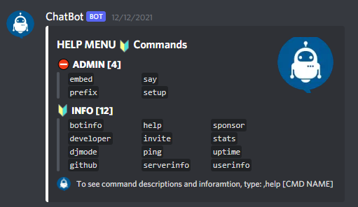
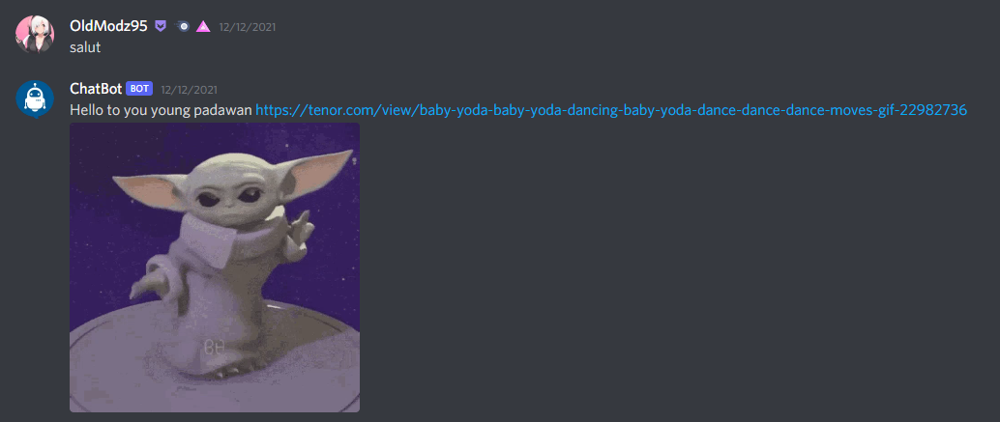
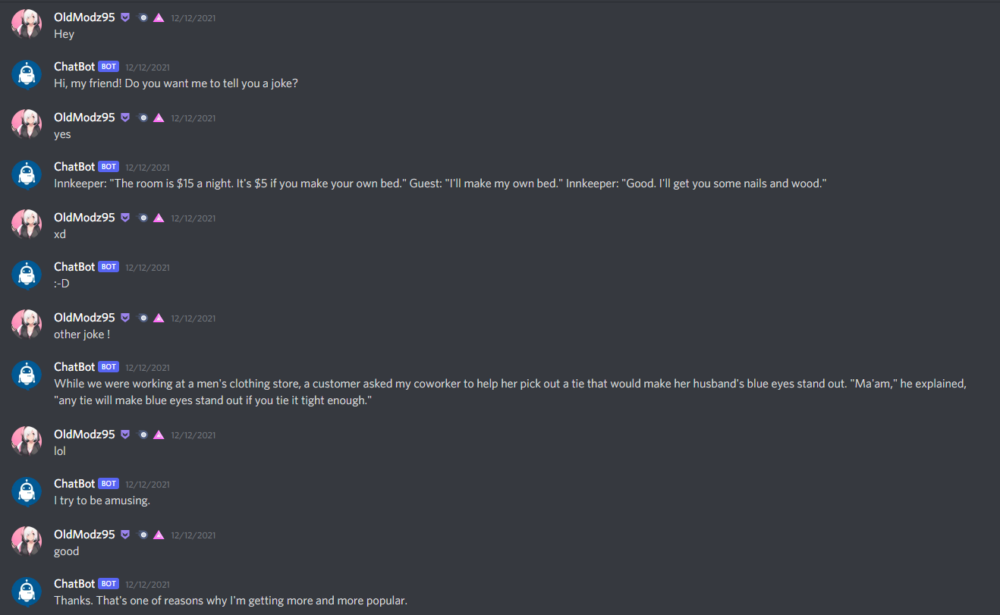
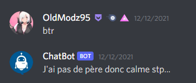
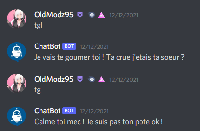

<h1 align="center">

OldModz95

</h1>
<p align="center">
  <a href="https://discord.gg/MS6TMgRfqB"></a>
</p>
<p align="center">
  <a href="https://discord.gg/M3sTyHtcK4"></a>
</p>

<br>

### Chat Bot Discord By OldModz95 Proposed By ProtonDev
- Parler avec un bot discord, c'est possible, un peu débile par moment, mais possible.<br>
- Talking with a discord bot is possible, a little stupid at times, but possible.
<br><br>

## REJOIGNIEZ LE SERVEUR DISCORD - JOIN SERVER DISCORD!!!!!!!!!!!!!!!!!!!!!!!!

https://discord.gg/MS6TMgRfqB
<br><br>


## Installation
<br>

Create account: [brainshop.ai](https://brainshop.ai/user/register)
<br>
Aller dans le fichier `botconfig/config.json`/Go to file `botconfig/config.json`:
```
{
  "token": "ADD YOUR TOKEN",
  "prefix": "ADD YOUR PREFIX",

  "b_id": "ADD ID ACCOUNT brainshop.ai",
  "b_key": "ADD KEY ACCOUNT brainshop.ai"
}
```

<br>

Aller dans le fichier `botconfig/embed.json`/Go to file `botconfig/embed.json`:
`Custom embed`
```
{
  "color": "#fffff9",
  "wrongcolor": "RED",
  "footertext": "Chat Bot | powered by protondev.eu",
  "footericon": "https://i.imgur.com/1QEJlOd.png"
}
```

<br>

Start bot `node .` or `node index.js`
Commands `setup + mention channel chat bot`

<br><br>

## Information Modules

```
ascii-table: 0.0.9
colors: 1.4.0
cpu-stat: 2.0.1
discord.js: 12.5.1
enmap: 5.8.4
```

<br><br>

## Information Commands


### ADMIN

```
embed
prefix
say
setup
```

### Information

```
botinfo
developer
djmode
github
help
invite
ping
serverinfo
sponsor
stats
uptime
userinfo
```

<br>

### Note:

If you are having errors/problems with starting delete the `package.json` file and do, before you install the packages `npm init`


<br>


<br>
<br>

# Install NodeJS
<br>

[Download NodeJS](https://nodejs.org/en/)


<br>
<br>

<br>

## Video Tutoriel

```
Bientôt disponible
Soon...
```


<br>
<br>

<br>

## IMAGE

<br>

# Commands Help

<br>

# Send message hey

<br>

# Chat bot

<br>

# French respons custom

<br><br>

<br>


<br><br>


## 📞 Contact me

[Discord](https://www.discord.gg/MS6TMgRfqB)
[Twitter](https://twitter.com/oldmodz95)
<br>
[YouTube (Server Private)](https://exotique.fr2.quickconnect.to/?launchApp=SYNO.SDS.VideoStation.AppInstance#!libOldModz95/N4IgNglgRgTghjAniAXCAFgewLYFMD6AbhACa6YC0A7CADQgDGcALrgOaZKohxhh0gADnDa5UARgC+QA)
<p>Username: ytb <br>
Password: oldmodz95</p>

<br />

## 🔧 Technologies & Tools


###### Version control system


###### License


###### Operating systems


## &#x1f4c8; GitHub Stats

<a href="https://github.com/OldModz95-YTB">
  
</>
<a href="https://github.com/OldModz95-YTB">
  
</a>

<p align="left">  </p>
